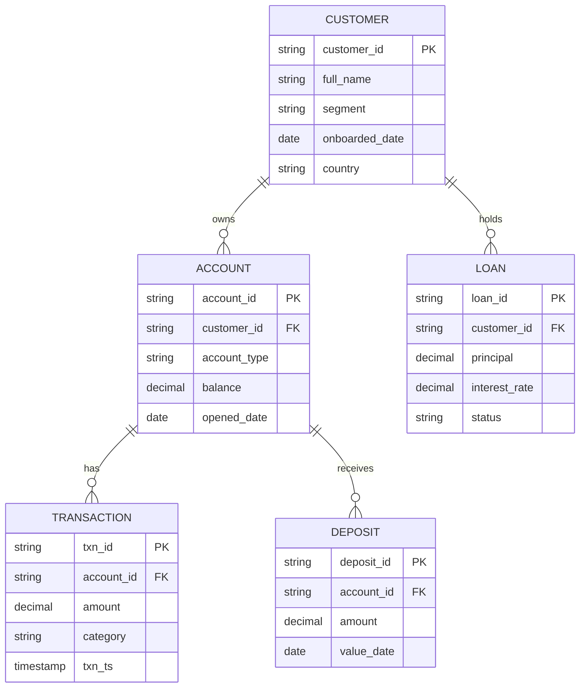

# Data model

The curated layer is modeled as a star schema: `fact_transaction` and
`fact_deposit` as fact tables, with `dim_customer`, `dim_account`, and
`dim_loan` as dimensions.

## ER diagram

## Table grain

| Table | Grain | Type |
|---|---|---|
| `dim_customer` | one row per customer | dimension |
| `dim_account` | one row per account | dimension |
| `dim_loan` | one row per loan | dimension |
| `fact_transaction` | one row per transaction event | fact, partitioned by `txn_date` |
| `fact_deposit` | one row per deposit event | fact |

## Partitioning

`fact_transaction` is partitioned by `txn_date` to keep query costs down in
Athena/Redshift Spectrum and to make the Iceberg table manageable at scale.
